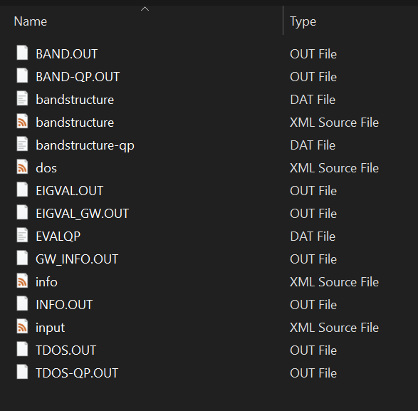
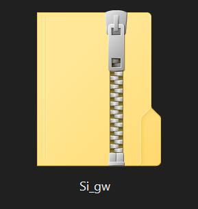

# FAIRmat training materials

## Prepare the input and output files from the *exciting* package

Once the calculation is performed using the *exciting* package, you will need to prepare your files for upload to NOMAD. 

1. For the GW/DFT calcualtion in this example, ensure the you have current files in a single folder in your local computer. 

2. Compress the files into a .zip or .gar.tz
